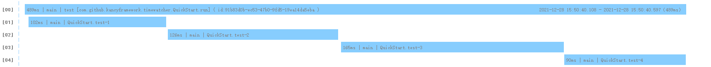

### time-watcher-core
> time-watcher的核心处理逻辑

#### 快速开始

```java
// 1.开始
TimeWatcher.quickStart("test");

// 2.观察
TimeWatcher.watch("test-1", ()-> sleep(100));
TimeWatcher.watch("test-2", () -> sleep(120));
TimeWatcher.watch("test-3", this::randomSleep);
TimeWatcher.watch("test-4", this::randomSleep);

// 3.停止
TimeWatcher.stop();

// 4.1.将图形化报告保存成文件
TimeWatcher.saveImageReport();

// 4.2.显示GUI图形化报告
TimeWatcher.showGuiReport();

```

#### 图形化报告

1)简单版本 (单线程串行)



2)复杂版本 (多线程串行)


3)高级版本 (多线程串行)

