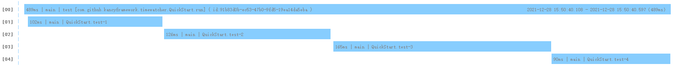

### time-watcher-spring-boot-starter
> Time Watcher Spring Boot 启动器


#### 快速开始

##### 导入maven依赖

```xml
<dependency>
    <groupId>com.github.kancyframework</groupId>
    <artifactId>time-watcher-spring-boot-starter</artifactId>
    <version>0.0.2-RELEASE</version>
</dependency>
```

##### 耗时分析

1）在需要监听的方法上添加`@Watcher`注解即可

2）使用TimeWatcher.watch()包装需要观察耗时的逻辑代码

```
package com.github.kancyframework.timewatcher;

import com.github.kancyframework.timewatcher.annotation.Watcher;
import org.springframework.web.bind.annotation.GetMapping;
import org.springframework.web.bind.annotation.RestController;

import java.util.concurrent.ThreadLocalRandom;

/**
 * QuickStart
 *
 * @author admin
 * @date 2021/12/28 15:58
 */
@RestController
public class QuickStartController {

    @Watcher
    @GetMapping("/quick/start")
    public void quickStart() {
        TimeWatcher.watch("controller-test-1", this::randomSleep);
        TimeWatcher.watch("controller-test-2", this::randomSleep);
        TimeWatcher.watch("controller-test-3", this::randomSleep);
    }

    private void randomSleep() {
        sleep(ThreadLocalRandom.current().nextInt(0,500));
    }

    private Object sleep(int i) {
        try {
            Thread.sleep(i);
        } catch (InterruptedException e) {
            e.printStackTrace();
        }
        return 0;
    }
}

```

##### 耗时报告




#### 属性讲解

1)全局配置
```properties
# timewatcher总开关
timewatcher.enabled=true
# 采样率（不需要每次都采样）
timewatcher.sample-rate=0.5
# 最大的花费时间（每次请求的耗时低于改值时不采样）
timewatcher.max-total-cost-millis=1000
# 每次观测最大的花费时间（每次观测的耗时低于改值时不采样）
timewatcher.max-cost-millis=10

# JDBC结果处理器 (将报告信息保存到数据库，默认关闭)
timewatcher.result-handlers.jdbc=true
# 自定义的jdbcTemplate
timewatcher.jdbc-template-bean-name=timewatcherJdbcTemplate
# 报告明细数据的表名（有权限时自动创建）
timewatcher.jdbc-report-info-table-name=t_timewatcher_report_info
# 报告数据的表名（有权限时自动创建）
timewatcher.jdbc-report-table-name=t_timewatcher_report

# 线程池配置
timewatcher.task-executor.core-pool-size=10
timewatcher.task-executor.max-pool-size=10

# mdc threadlocal handler开关（复制MDC上下文）
timewatcher.task-executor.thread-local-handlers.mdc=true
```

2）局部配置
```properties
# 单个watcher 开关
timewatcher.{watcher}.enabled=true
# 单个watcher 采样率（不需要每次都采样）
timewatcher.{watcher}.sample-rate=0.5
# 单个watcher 最大的花费时间（每次请求的耗时低于改值时不采样）
timewatcher.{watcher}.max-total-cost-millis=1000
# 单个watcher 每次观测最大的花费时间（每次观测的耗时低于改值时不采样）
timewatcher.{watcher}.max-cost-millis=10
```

3）注解配置

`@Watcher(name = "quickStart", maxTotalCostMillis = 1000, maxCostMillis = 10, enabled = false)`

`@TimeWatcher(name = "quickStart", maxTotalCostMillis = 1000, maxCostMillis = 10, enabled = true)`


##### 配置优先级

1)配置文件 > 注解

2)局部配置 > 全局配置 （除`timewatcher.enabled`外）


#### 定制化功能

##### 耗时拦截器
> com.github.kancyframework.timewatcher.interceptor.TimeWatchInterceptor


##### 事件监听

1）Started事件
> com.github.kancyframework.timewatcher.event.TimeWatchStartedEvent

观察开始时发布事件，使用`ApplicationListener`可进行监听，处理额外逻辑。

2）Stoped事件
> com.github.kancyframework.timewatcher.event.TimeWatchStoppedEvent

观察结束时发布事件，使用`ApplicationListener`可进行监听，处理额外逻辑。

##### 耗时报告处理器
> com.github.kancyframework.timewatcher.handler.TimeWatchResultHandler

观察结束时，会将报告结果回调给`TimeWatchResultHandler`，内置`JdbcTimeWatchResultHandler`可以将耗时明细数据以及报告保存到数据库，前提是打开jdbc结果处理开关。


**内置JdbcTimeWatchResultHandler**
```
# JDBC结果处理器 (将报告信息保存到数据库，默认关闭)
timewatcher.result-handlers.jdbc=true
```

##### 线程上下文处理器
> com.github.kancyframework.timewatcher.handler.ThreadLocalHandler

TimeWatchResultHandler 处理时默认是异步的，可以通过自定义ThreadLocalHandler实现主线程和任务处理线程的上下文传递。

**内置MdcThreadLocalHandler**
```
# 默认是开启的
timewatcher.task-executor.thread-local-handlers.mdc=true
```
